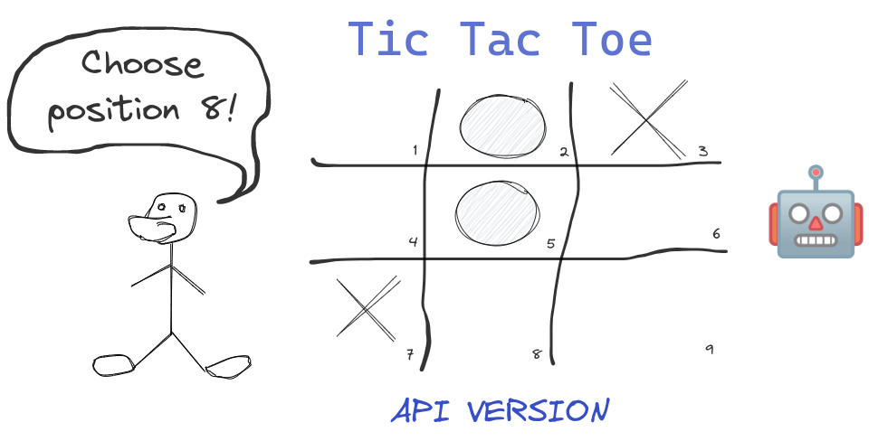
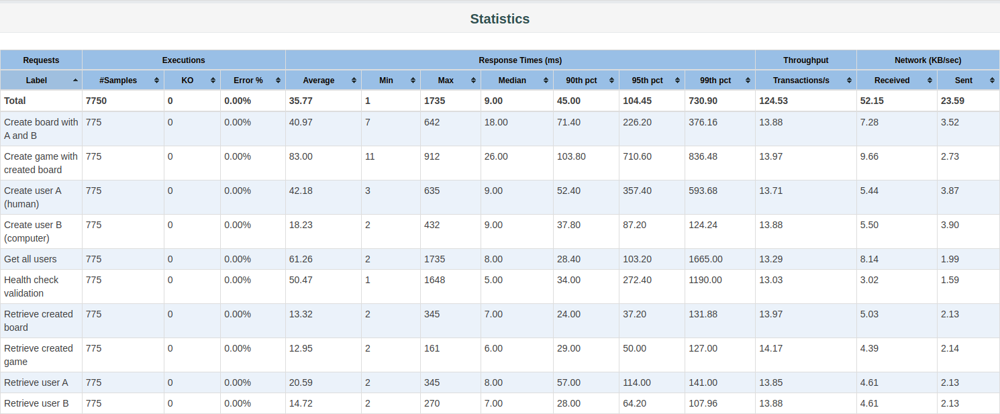

# Tic Tac Toe C# Playground

[](https://sonarcloud.io/dashboard?id=willianantunes_tic-tac-toe-csharp-playground)
[](https://sonarcloud.io/dashboard?id=willianantunes_tic-tac-toe-csharp-playground)



This project is a full implementation of the [Tic Tac Toe](https://en.wikipedia.org/wiki/Tic-tac-toe) game but playable through a REST API. All the game data is saved in the database to make this challenge more fun. Run it now and play an honest game 🎮!

It's written in C# and uses ASP.NET Web API. Some more details:

- [CliFx](https://github.com/Tyrrrz/CliFx) is used to start the application. You can use it to start your worker, seed your database, and many more.
- [AutoMapper](https://github.com/AutoMapper/AutoMapper) is used by the Core layer to return DTO objects to the Api layer.
- [Serilog](https://github.com/serilog/serilog) handles everything concerning logging.
- [Npgsql](https://github.com/npgsql/npgsql) is the data provider for PostgreSQL that is used by Entity Framework.
- [DrfLikePaginations](https://github.com/willianantunes/drf-like-paginations/) handles the pagination. It supports [Cursor](https://github.com/willianantunes/drf-like-paginations/blob/e40ab8c79ccec34c75dd3acf79c87e4023df0dbf/src/CursorPagination.cs) and [Offset](https://github.com/willianantunes/drf-like-paginations/blob/e40ab8c79ccec34c75dd3acf79c87e4023df0dbf/src/LimitOffsetPagination.cs) paginations.

## Playing a game!

First run the project through the command below. It will generate any migrations that are missing, apply them, and run the project afterwards ([check out the script responsible for that](scripts/start-web-development.sh)):

    docker-compose up app-development

Then you can create players, a board, and play your game! Below you can check some [HTTPie](https://httpie.io/) commands to play with the API.

```shell
# First create a player for you
http POST :8000/api/v1/players name=Jafar
# Then to someone who can play with you, let's say a computer
http POST :8000/api/v1/players name=Rose computer:=true
# You can list them with pagination!
http GET :8000/api/v1/players
# You can filter also! Know this project: https://github.com/willianantunes/drf-like-paginations/
http GET :8000/api/v1/players computer==false
# In order to have a game, you first need to create a board
http POST :8000/api/v1/boards firstPlayerId=1 secondPlayerId=2
# Then you are good to go!
# If you are lucky, you can win with three movements like the following:
http GET :8000/api/v1/games/play BoardId==1 PlayerId==1 MovementPosition==1
http GET :8000/api/v1/games/play BoardId==1 PlayerId==1 MovementPosition==2
http GET :8000/api/v1/games/play BoardId==1 PlayerId==1 MovementPosition==3
# Get the game details given its ID:
http GET :8000/api/v1/games/1
```

Sample GIF that shows a winning game with 4 movements (positions 1, 7, 8, and 9):


## Architecture details

This project has 4 layers:

- API: ASP.NET Core stuff.
- Core: All business logic.
- Infrastructure: The database is fully configured in this layer.
- EntryCommands: It's like the [`Startup.cs`](https://docs.microsoft.com/en-us/aspnet/core/fundamentals/startup?view=aspnetcore-5.0#the-startup-class).

 

It's important to mention that I didn't use the standard way to start the project, given from the webapi boilerplate project. `CliFx` plays an essential role as the command handler of the program. The idea was to mimic how Django works because it's easy to understand and test.

About the entities:


You can check how I configured these 5 tables using the EF Fluent API in [AppDbContext class](https://github.com/willianantunes/tic-tac-toe-csharp-playground/blob/6d900c128a0032a9d1c9be03481a3c8825153024/src/Infrastructure/Database/AppDbContext.cs#L26-L32).

## Running tests and how I use the real database to handle parallel testing

To run all tests, you can simply execute the command:

    docker-compose up tests

It will wait until the database is up and execute all the tests using the project's actual database (PostgreSQL).

To allow each integration test to be executed isolated without worries of race conditions or dirty data, I create one dedicated database per method test. You can check how I handled it by looking at the class [IntegrationTestsFixture](https://github.com/willianantunes/tic-tac-toe-csharp-playground/blob/922d1dc5d902e8e9911864af06ff98f332a8ceb8/tests/Support/IntegrationTestsFixture.cs#L27-L54).

## Robot logic 

If you look at the [PositionDecider class](https://github.com/willianantunes/tic-tac-toe-csharp-playground/blob/c78d68642bced98161bbbfaffb8f8d871ffbc506/src/Core/Business/PositionDecider.cs#L13), you'll notice that I simply choose a random available position from the list. During the tests, I used an even simpler version ([CustomPositionDecider
 class](https://github.com/willianantunes/tic-tac-toe-csharp-playground/blob/157dc10375a19e0aa00bf209b27227b4fbdf560f/tests/Support/CustomPositionDecider.cs#L7)) that merely select the first item from the ordered list. I could create a test that asserts a winning game with three movements only (7, 8, and 9) on a 3x3 board with this approach (see it in [this test in GameServiceITests class](https://github.com/willianantunes/tic-tac-toe-csharp-playground/blob/ca91927d303706b65611ab9c5628945f70f9fdd8/tests/TicTacToeCSharpPlayground/Core/Services/GameServiceITests.cs#L203-L250)).

## Load testing

The test plan [jmeter-test-plan.jmx](./tests/LoadTesting/jmeter-test-plan.jmx) can be opened with JMeter 5.4.1. The `Thread Group` basically has the following configurations:


In order to run it, first you should apply the migrations with the command:

    docker-compose up apply-migrations

As the database is ready to be used, you can run the production version of the Tic Tac Toe program:

    docker-compose up app

Then you can open a new terminal and finally run:

    docker-compose up load-test

When the load testing is concluded, you can open the file `tests-jmeter/index.html`. Check out this statistics:



The output with regards to [APDEX](https://en.wikipedia.org/wiki/Apdex):


## Why did I create this project 🤔?

The best way to learn a new language, apart from reading documentation and books, is by coding, focusing on practice instead of theory, at least that's what I believe. But, of course, this is even better when you have some programming background. The problem is, though, which project can we do to learn a new language? I don't think a CRUD application is good because it doesn't provide challenges concerning abstractions, data structures, iteration statements, conditionals, and many more. Now a project related to an actual game can really bring you benefits, but not a too complicated one because, in the end, it consumes lots of time. 

I think Hangman and Tic Tac Toe are good examples to start with. It's a good idea to start with a console application, then evolve it to be more challenging, like including a REST API with a Database, thus bringing a taste about how an actual project is in a company. So, to learn C#, I followed this path. I suggest it to everyone!
